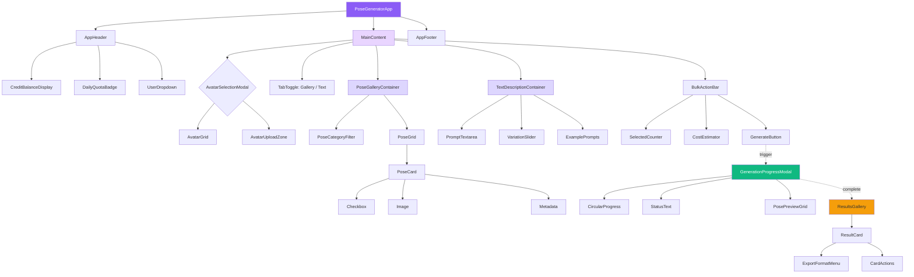

# Pose Generator - UI/UX Design Specification

**Document Version:** 1.0
**Date:** October 14, 2025
**Status:** Production-Ready Design
**Target Launch:** Q1 2026
**Design Quality:** Premium, Studio-Grade Interface

---

## Table of Contents

1. [Design Philosophy](#1-design-philosophy)
2. [Design System](#2-design-system)
3. [Component Architecture](#3-component-architecture)
4. [Component Specifications](#4-component-specifications)
5. [User Journey Flows](#5-user-journey-flows)
6. [Responsive Design Strategy](#6-responsive-design-strategy)
7. [Animation & Micro-interactions](#7-animation--micro-interactions)
8. [State Management](#8-state-management)
9. [API Integration](#9-api-integration)
10. [Accessibility Standards](#10-accessibility-standards)
11. [Implementation Roadmap](#11-implementation-roadmap)

---

## 1. Design Philosophy

### 1.1 Core Principles

**Premium Visual Language**
- Sophisticated color palette with depth and dimension
- Generous whitespace for breathing room (32px+ between major sections)
- Premium typography with clear hierarchy
- Subtle shadows and gradients that add depth without distraction
- Custom micro-interactions that delight users

**Effortless User Experience**
- Every interaction should require zero mental effort
- Progressive disclosure - show advanced options only when needed
- Smart defaults - 80% of users should never change settings
- Real-time feedback - users always know what's happening
- Clear cost visibility - no surprise charges

**Speed & Efficiency**
- Gallery loads in <1 second with skeleton screens
- Infinite scroll with 24 poses per page
- Multi-select with keyboard shortcuts (Shift+Click)
- Bulk actions sticky bar appears instantly
- Progress updates every 2-3 seconds

**Professional Quality**
- Interface quality matches studio photography output
- Clean, modern aesthetic suitable for business use
- Indonesian localization throughout
- Mobile-first approach for UMKM users

### 1.2 Competitive Advantages

**vs. SellerPic.ai:**
- Cleaner visual hierarchy (less cluttered)
- Better mobile experience (touch-optimized)
- Real-time progress with WebSocket (not polling)
- More flexible pricing tiers
- Integrated with Avatar Creator (no manual uploads)

**vs. Generic AI Tools:**
- Purpose-built for Indonesian UMKM
- Curated pose library (not generic prompts)
- Clear pricing in Rupiah (not USD)
- Fast generation (30s vs 2-5 minutes)

---

## 2. Design System

### 2.1 Color Palette

#### Primary Colors
```css
--primary-50: #F5F3FF;    /* Background tints */
--primary-100: #EDE9FE;   /* Hover states */
--primary-200: #DDD6FE;   /* Borders */
--primary-300: #C4B5FD;   /* Disabled */
--primary-400: #A78BFA;   /* Secondary actions */
--primary-500: #8B5CF6;   /* Primary brand */
--primary-600: #7C3AED;   /* Hover primary */
--primary-700: #6D28D9;   /* Active primary */
--primary-800: #5B21B6;   /* Text on light */
--primary-900: #4C1D95;   /* Darkest */
```

#### Semantic Colors
```css
/* Success */
--success-50: #ECFDF5;
--success-500: #10B981;
--success-700: #047857;

/* Warning */
--warning-50: #FFFBEB;
--warning-500: #F59E0B;
--warning-700: #B45309;

/* Error */
--error-50: #FEF2F2;
--error-500: #EF4444;
--error-700: #B91C1C;

/* Neutral Grays */
--gray-50: #F9FAFB;
--gray-100: #F3F4F6;
--gray-200: #E5E7EB;
--gray-300: #D1D5DB;
--gray-400: #9CA3AF;
--gray-500: #6B7280;
--gray-600: #4B5563;
--gray-700: #374151;
--gray-800: #1F2937;
--gray-900: #111827;
```

#### Gradient Overlays (Premium Touch)
```css
/* Subtle background gradients */
--gradient-primary: linear-gradient(135deg, #8B5CF6 0%, #6D28D9 100%);
--gradient-success: linear-gradient(135deg, #10B981 0%, #047857 100%);
--gradient-card: linear-gradient(180deg, rgba(255,255,255,0) 0%, rgba(0,0,0,0.03) 100%);
--gradient-shimmer: linear-gradient(90deg,
  transparent 0%,
  rgba(139, 92, 246, 0.1) 50%,
  transparent 100%);
```

### 2.2 Typography Scale

#### Font Families
```css
--font-sans: 'Inter', -apple-system, BlinkMacSystemFont, 'Segoe UI', sans-serif;
--font-display: 'Inter', sans-serif; /* Headings */
--font-mono: 'JetBrains Mono', 'Fira Code', monospace; /* Numbers, code */
```

#### Type Scale (Tailwind-compatible)
```css
/* Display (Hero sections) */
--text-display: 4.5rem / 1.1;      /* 72px, display-1 */
--text-display-2: 3.75rem / 1.1;   /* 60px, display-2 */

/* Headings */
--text-h1: 3rem / 1.2;             /* 48px, h1 */
--text-h2: 2.25rem / 1.3;          /* 36px, h2 */
--text-h3: 1.875rem / 1.3;         /* 30px, h3 */
--text-h4: 1.5rem / 1.4;           /* 24px, h4 */
--text-h5: 1.25rem / 1.5;          /* 20px, h5 */
--text-h6: 1.125rem / 1.5;         /* 18px, h6 */

/* Body */
--text-body-lg: 1.125rem / 1.6;    /* 18px */
--text-body: 1rem / 1.6;           /* 16px - base */
--text-body-sm: 0.875rem / 1.6;    /* 14px */
--text-body-xs: 0.75rem / 1.5;     /* 12px */

/* Utility */
--text-caption: 0.75rem / 1.4;     /* 12px - captions */
--text-overline: 0.75rem / 1.2;    /* 12px - uppercase labels */
```

#### Font Weights
```css
--font-light: 300;
--font-normal: 400;
--font-medium: 500;
--font-semibold: 600;
--font-bold: 700;
--font-extrabold: 800;
```

### 2.3 Spacing System

**Base Unit:** 4px

```css
--space-0: 0;
--space-1: 4px;
--space-2: 8px;
--space-3: 12px;
--space-4: 16px;
--space-5: 20px;
--space-6: 24px;
--space-8: 32px;
--space-10: 40px;
--space-12: 48px;
--space-16: 64px;
--space-20: 80px;
--space-24: 96px;
--space-32: 128px;
```

### 2.4 Elevation System (Shadows)

```css
/* Subtle depth for cards */
--shadow-xs: 0 1px 2px 0 rgba(0, 0, 0, 0.05);

/* Standard card elevation */
--shadow-sm: 0 1px 3px 0 rgba(0, 0, 0, 0.1),
             0 1px 2px -1px rgba(0, 0, 0, 0.1);

/* Hover state */
--shadow-md: 0 4px 6px -1px rgba(0, 0, 0, 0.1),
             0 2px 4px -2px rgba(0, 0, 0, 0.1);

/* Dropdown menus */
--shadow-lg: 0 10px 15px -3px rgba(0, 0, 0, 0.1),
             0 4px 6px -4px rgba(0, 0, 0, 0.1);

/* Modals */
--shadow-xl: 0 20px 25px -5px rgba(0, 0, 0, 0.1),
             0 8px 10px -6px rgba(0, 0, 0, 0.1);

/* Dramatic elevation (hero elements) */
--shadow-2xl: 0 25px 50px -12px rgba(0, 0, 0, 0.25);

/* Colored shadow for primary elements */
--shadow-primary: 0 8px 16px -4px rgba(139, 92, 246, 0.3);
```

### 2.5 Border Radius

```css
--radius-none: 0;
--radius-sm: 4px;      /* Small elements */
--radius-md: 8px;      /* Standard (cards, buttons) */
--radius-lg: 12px;     /* Large cards */
--radius-xl: 16px;     /* Modals */
--radius-2xl: 24px;    /* Hero sections */
--radius-full: 9999px; /* Pills, avatars */
```

### 2.6 Animation Tokens

```css
/* Duration */
--duration-instant: 100ms;
--duration-fast: 150ms;
--duration-normal: 200ms;
--duration-slow: 300ms;
--duration-slower: 500ms;

/* Easing */
--ease-linear: cubic-bezier(0, 0, 1, 1);
--ease-in: cubic-bezier(0.4, 0, 1, 1);
--ease-out: cubic-bezier(0, 0, 0.2, 1);
--ease-in-out: cubic-bezier(0.4, 0, 0.2, 1);
--ease-bounce: cubic-bezier(0.68, -0.55, 0.265, 1.55);
--ease-spring: cubic-bezier(0.175, 0.885, 0.32, 1.275);
```

### 2.7 Breakpoints

```css
/* Mobile-first approach */
--screen-sm: 640px;    /* Small tablet */
--screen-md: 768px;    /* Tablet */
--screen-lg: 1024px;   /* Small desktop */
--screen-xl: 1280px;   /* Desktop */
--screen-2xl: 1536px;  /* Large desktop */
```

### 2.8 Icon Library

**Primary:** Lucide React (consistent, open-source)

**Common Icons:**
```typescript
import {
  // Navigation
  Home, ArrowLeft, Menu, X,

  // Actions
  Plus, Trash2, Download, Upload, Share2, Heart,
  RefreshCw, ZoomIn, ZoomOut, Maximize2,

  // Status
  Check, CheckCircle, AlertCircle, Info, AlertTriangle,
  XCircle, Loader2, Clock, Calendar,

  // Content
  Image, Folder, File, Search, Filter, Grid, List,
  Eye, EyeOff, Edit3, Copy, ExternalLink,

  // User
  User, Users, CreditCard, Settings, LogOut,

  // Pose specific
  Sparkles, Wand2, Camera, Layers, Frame,
  Move, RotateCw, Crop
} from 'lucide-react'
```

---

## 3. Component Architecture

### 3.1 Application Structure

```
PoseGeneratorApp/
├── Layout/
│   ├── AppHeader                    # Sticky header with branding, credits
│   ├── AppNavigation                # Back to dashboard, help links
│   └── AppFooter                    # Support, documentation
│
├── AvatarSelection/
│   ├── AvatarSelectionModal         # Initial avatar picker
│   ├── AvatarCard                   # Individual avatar display
│   └── AvatarUploadZone             # Drag-drop upload area
│
├── PoseGallery/
│   ├── PoseGalleryContainer         # Main gallery wrapper
│   ├── PoseCategoryFilter           # Category chips/dropdown
│   ├── PoseGrid                     # Responsive grid layout
│   ├── PoseCard                     # Individual pose with checkbox
│   └── PoseCardSkeleton             # Loading state
│
├── TextDescription/
│   ├── TextDescriptionContainer     # Text mode wrapper
│   ├── PromptTextarea               # Large textarea input
│   ├── VariationSlider              # Count selector (1-20)
│   └── ExamplePrompts               # Clickable examples
│
├── Selection/
│   ├── BulkActionBar                # Sticky bottom bar
│   ├── CostEstimator                # Real-time cost calculation
│   └── SelectedPosesPreview         # Mini thumbnails of selections
│
├── Generation/
│   ├── GenerationProgressModal      # Full-screen progress overlay
│   ├── CircularProgress             # Animated progress ring
│   ├── PosePreviewGrid              # Completed poses thumbnails
│   └── GenerationStatusText         # Current status messages
│
├── Results/
│   ├── ResultsGallery               # Final output grid
│   ├── ResultCard                   # Individual result with actions
│   ├── ExportFormatMenu             # Multi-format download
│   └── BulkResultActions            # Bulk download, delete
│
├── Pricing/
│   ├── CreditBalanceDisplay         # Header credit indicator
│   ├── DailyQuotaBadge             # Unlimited tier quota
│   ├── InsufficientCreditsModal     # Top-up prompt
│   └── PricingTierBadge             # User tier indicator
│
└── Shared/
    ├── Button                       # Primary, secondary, ghost
    ├── Modal                        # Base modal component
    ├── Toast                        # Notifications
    ├── Tooltip                      # Helper tooltips
    ├── Badge                        # Status badges
    ├── Spinner                      # Loading indicator
    └── EmptyState                   # No content placeholder
```

### 3.2 Component Hierarchy Diagram



---

## 4. Component Specifications

### 4.1 AppHeader

**Purpose:** Sticky header providing app context, credit balance, and user actions.

**Visual Design:**
```
┌─────────────────────────────────────────────────────────────────────┐
│  [Pose Gen Icon]  Pose Generator        1,500 Credits  [⭐ Unlimited] │
│                                          45/100 today                  │
│                                                          [User Avatar] │
└─────────────────────────────────────────────────────────────────────┘
```

**Props Interface:**
```typescript
interface AppHeaderProps {
  creditBalance: number
  isUnlimitedActive: boolean
  dailyQuotaUsed?: number
  dailyQuotaLimit?: number
  quotaResetTime?: Date
  onNavigateBack: () => void
}
```

**Component Structure:**
```typescript
export function AppHeader({
  creditBalance,
  isUnlimitedActive,
  dailyQuotaUsed,
  dailyQuotaLimit,
  quotaResetTime,
  onNavigateBack
}: AppHeaderProps) {
  return (
    <header className="sticky top-0 z-50 border-b border-gray-200 bg-white/80 backdrop-blur-lg">
      <div className="container mx-auto px-4 h-16 flex items-center justify-between">
        {/* Left: Branding */}
        <div className="flex items-center gap-4">
          <button
            onClick={onNavigateBack}
            className="p-2 hover:bg-gray-100 rounded-lg transition-colors"
          >
            <ArrowLeft className="w-5 h-5 text-gray-600" />
          </button>

          <div className="flex items-center gap-3">
            <div className="w-10 h-10 rounded-xl bg-gradient-primary flex items-center justify-center">
              <Sparkles className="w-6 h-6 text-white" />
            </div>
            <div>
              <h1 className="text-lg font-semibold text-gray-900">
                Pose Generator
              </h1>
              <p className="text-xs text-gray-500">Studio-quality AI poses</p>
            </div>
          </div>
        </div>

        {/* Right: Credits & User */}
        <div className="flex items-center gap-4">
          {isUnlimitedActive ? (
            <DailyQuotaBadge
              used={dailyQuotaUsed}
              limit={dailyQuotaLimit}
              resetTime={quotaResetTime}
            />
          ) : (
            <CreditBalanceDisplay balance={creditBalance} />
          )}

          <UserDropdownMenu />
        </div>
      </div>
    </header>
  )
}
```

**Styling:**
```css
/* Frosted glass effect */
.backdrop-blur-lg {
  backdrop-filter: blur(16px);
  -webkit-backdrop-filter: blur(16px);
}

/* Subtle bottom border */
.border-b {
  border-bottom: 1px solid rgba(0, 0, 0, 0.06);
}
```

**Responsive Behavior:**
- Desktop (>1024px): Full layout with all elements visible
- Tablet (768-1024px): Collapse subtitle, reduce spacing
- Mobile (<768px): Hide subtitle, collapse credit display to icon only

**Accessibility:**
- Sticky header has `aria-label="Application header"`
- Back button: `aria-label="Back to dashboard"`
- Credit display: `aria-label="Current credit balance: 1500 credits"`

---

### 4.2 AvatarSelectionModal

**Purpose:** Initial modal for selecting avatar model before pose generation.

**Visual Design:**
```
┌──────────────────────────────────────────────────────────────┐
│                                                            [X]│
│  Select Your Avatar Model                                    │
│  Choose an avatar to apply poses to                          │
│                                                               │
│  ┌─────────────────────────────────────────────────────┐    │
│  │  My Avatars from Avatar Creator                      │    │
│  │                                                       │    │
│  │  [Avatar 1]  [Avatar 2]  [Avatar 3]  [Avatar 4]     │    │
│  │   Persona     Persona     Persona     Persona        │    │
│  │                                                       │    │
│  └─────────────────────────────────────────────────────┘    │
│                                                               │
│  ┌─────────────────────────────────────────────────────┐    │
│  │  Upload New Photo                                    │    │
│  │                                                       │    │
│  │  ╔═══════════════════════════════════════════╗      │    │
│  │  ║  📷  Drag & drop or click to upload       ║      │    │
│  │  ║     JPG, PNG, WEBP up to 10 MB            ║      │    │
│  │  ╚═══════════════════════════════════════════╝      │    │
│  │                                                       │    │
│  └─────────────────────────────────────────────────────┘    │
│                                                               │
│  [Cancel]                [Continue with Selected Avatar]     │
└──────────────────────────────────────────────────────────────┘
```

**Props Interface:**
```typescript
interface AvatarSelectionModalProps {
  isOpen: boolean
  onClose: () => void
  onSelect: (avatar: Avatar | File) => void
  userAvatars: Avatar[]
  isLoading?: boolean
}

interface Avatar {
  id: string
  imageUrl: string
  personaName: string
  createdAt: Date
}
```

**Component Structure:**
```typescript
export function AvatarSelectionModal({
  isOpen,
  onClose,
  onSelect,
  userAvatars,
  isLoading
}: AvatarSelectionModalProps) {
  const [selectedAvatar, setSelectedAvatar] = useState<Avatar | null>(null)
  const [uploadedFile, setUploadedFile] = useState<File | null>(null)

  const handleContinue = () => {
    if (selectedAvatar) {
      onSelect(selectedAvatar)
    } else if (uploadedFile) {
      onSelect(uploadedFile)
    }
  }

  return (
    <Modal
      isOpen={isOpen}
      onClose={onClose}
      size="2xl"
      className="overflow-hidden"
    >
      <ModalHeader>
        <h2 className="text-2xl font-bold text-gray-900">
          Select Your Avatar Model
        </h2>
        <p className="text-sm text-gray-600 mt-1">
          Choose an avatar to apply poses to
        </p>
      </ModalHeader>

      <ModalBody className="space-y-6 py-6">
        {/* Existing Avatars */}
        <section>
          <h3 className="text-lg font-semibold text-gray-900 mb-4">
            My Avatars from Avatar Creator
          </h3>

          {isLoading ? (
            <AvatarGridSkeleton />
          ) : userAvatars.length === 0 ? (
            <EmptyState
              icon={User}
              title="No avatars yet"
              description="Create an avatar in Avatar Creator first"
              action={{
                label: "Go to Avatar Creator",
                onClick: () => navigateToAvatarCreator()
              }}
            />
          ) : (
            <div className="grid grid-cols-4 gap-4">
              {userAvatars.map((avatar) => (
                <AvatarCard
                  key={avatar.id}
                  avatar={avatar}
                  isSelected={selectedAvatar?.id === avatar.id}
                  onSelect={() => setSelectedAvatar(avatar)}
                />
              ))}
            </div>
          )}
        </section>

        {/* Upload Section */}
        <section>
          <h3 className="text-lg font-semibold text-gray-900 mb-4">
            Upload New Photo
          </h3>

          <AvatarUploadZone
            onFileSelect={(file) => {
              setUploadedFile(file)
              setSelectedAvatar(null) // Clear avatar selection
            }}
            currentFile={uploadedFile}
          />
        </section>
      </ModalBody>

      <ModalFooter className="border-t border-gray-200 bg-gray-50">
        <Button
          variant="ghost"
          onClick={onClose}
        >
          Cancel
        </Button>

        <Button
          variant="primary"
          onClick={handleContinue}
          disabled={!selectedAvatar && !uploadedFile}
        >
          Continue with Selected Avatar
        </Button>
      </ModalFooter>
    </Modal>
  )
}
```

**Animations:**
- Modal entrance: Scale 0.95 → 1.0 + fade (300ms ease-out)
- Avatar card hover: Scale 1.0 → 1.05 (150ms ease-out)
- Avatar card select: Border glow animation (200ms)
- Upload zone hover: Border color pulse

**Validation:**
- Only allow one selection (avatar OR upload, not both)
- Continue button disabled until selection made
- Upload validation: max 10MB, JPG/PNG/WEBP only

---

### 4.3 PoseCategoryFilter

**Purpose:** Category navigation for pose library filtering.

**Visual Design (Desktop):**
```
┌────────────────────────────────────────────────────────────┐
│  [All]  [Fashion Female]  [Fashion Male]  [Hijab]  [...▼] │
│  (500)      (120)            (95)          (80)            │
└────────────────────────────────────────────────────────────┘
```

**Visual Design (Mobile):**
```
┌──────────────────────────────────────────────────────┐
│  ← [All] [Fashion Female] [Fashion Male] [Hijab] →  │
│     ^^^ Active                                        │
└──────────────────────────────────────────────────────┘
```

**Props Interface:**
```typescript
interface PoseCategoryFilterProps {
  categories: PoseCategory[]
  activeCategory: string
  onCategoryChange: (categoryId: string) => void
  poseCounts: Record<string, number>
}

interface PoseCategory {
  id: string
  name: string
  displayName: string
  slug: string
  icon: string
  color: string
  poseCount: number
}
```

**Component Structure:**
```typescript
export function PoseCategoryFilter({
  categories,
  activeCategory,
  onCategoryChange,
  poseCounts
}: PoseCategoryFilterProps) {
  const isMobile = useMediaQuery('(max-width: 768px)')

  if (isMobile) {
    return (
      <div className="overflow-x-auto hide-scrollbar">
        <div className="flex gap-2 px-4 py-3">
          {categories.map((category) => (
            <CategoryChip
              key={category.id}
              category={category}
              isActive={activeCategory === category.id}
              count={poseCounts[category.id] || 0}
              onClick={() => onCategoryChange(category.id)}
            />
          ))}
        </div>
      </div>
    )
  }

  return (
    <div className="border-b border-gray-200 bg-white">
      <div className="container mx-auto px-4">
        <div className="flex gap-2 py-4 overflow-x-auto">
          <CategoryChip
            category={{ id: 'all', displayName: 'All Poses', icon: 'grid', color: '#8B5CF6' }}
            isActive={activeCategory === 'all'}
            count={categories.reduce((sum, cat) => sum + cat.poseCount, 0)}
            onClick={() => onCategoryChange('all')}
          />

          {categories.map((category) => (
            <CategoryChip
              key={category.id}
              category={category}
              isActive={activeCategory === category.id}
              count={poseCounts[category.id] || category.poseCount}
              onClick={() => onCategoryChange(category.id)}
            />
          ))}
        </div>
      </div>
    </div>
  )
}

function CategoryChip({
  category,
  isActive,
  count,
  onClick
}: {
  category: { displayName: string; icon: string; color: string }
  isActive: boolean
  count: number
  onClick: () => void
}) {
  const Icon = getIconByName(category.icon)

  return (
    <button
      onClick={onClick}
      className={cn(
        "flex items-center gap-2 px-4 py-2 rounded-full",
        "font-medium text-sm transition-all duration-200",
        "hover:scale-105 active:scale-95",
        isActive
          ? "bg-primary-500 text-white shadow-primary"
          : "bg-gray-100 text-gray-700 hover:bg-gray-200"
      )}
    >
      <Icon className="w-4 h-4" />
      <span>{category.displayName}</span>
      <span className={cn(
        "text-xs",
        isActive ? "text-primary-100" : "text-gray-500"
      )}>
        ({count})
      </span>
    </button>
  )
}
```

**Styling:**
```css
/* Hide scrollbar but keep functionality */
.hide-scrollbar {
  -ms-overflow-style: none;
  scrollbar-width: none;
}
.hide-scrollbar::-webkit-scrollbar {
  display: none;
}
```

**Animations:**
- Chip hover: Scale 1.0 → 1.05 (200ms ease-out)
- Active state: Background color transition (200ms)
- Icon rotation on click: 0deg → 360deg (300ms ease-in-out)

---

### 4.4 PoseCard

**Purpose:** Individual pose card with selection checkbox and metadata.

**Visual Design:**
```
┌─────────────────────────┐
│  [✓]              [Easy]│  ← Checkbox (top-right), Difficulty badge
│                         │
│                         │
│      [Pose Image]       │  ← Cover fit, aspect ratio 3:4
│                         │
│                         │
│                         │
├─────────────────────────┤
│ Professional Standing   │  ← Pose name
│ 1,234 uses              │  ← Popularity
└─────────────────────────┘
```

**Props Interface:**
```typescript
interface PoseCardProps {
  pose: PoseLibrary
  isSelected: boolean
  onToggleSelect: (poseId: string) => void
  onPreview?: (pose: PoseLibrary) => void
}

interface PoseLibrary {
  id: string
  name: string
  previewImageUrl: string
  thumbnailUrl?: string
  difficulty: 'beginner' | 'intermediate' | 'advanced'
  usageCount: number
  isFeatured: boolean
  isPremium: boolean
  tags: string[]
}
```

**Component Structure:**
```typescript
export function PoseCard({
  pose,
  isSelected,
  onToggleSelect,
  onPreview
}: PoseCardProps) {
  const [imageLoaded, setImageLoaded] = useState(false)
  const [isHovered, setIsHovered] = useState(false)

  return (
    <motion.div
      className={cn(
        "group relative bg-white rounded-xl overflow-hidden",
        "border-2 transition-all duration-200",
        "hover:shadow-md cursor-pointer",
        isSelected
          ? "border-primary-500 shadow-primary"
          : "border-gray-200 hover:border-primary-300"
      )}
      whileHover={{ scale: 1.03 }}
      whileTap={{ scale: 0.98 }}
      onMouseEnter={() => setIsHovered(true)}
      onMouseLeave={() => setIsHovered(false)}
      onClick={() => onToggleSelect(pose.id)}
    >
      {/* Checkbox Overlay */}
      <div className="absolute top-3 right-3 z-10">
        <div
          className={cn(
            "w-6 h-6 rounded-md border-2 flex items-center justify-center",
            "transition-all duration-200",
            isSelected
              ? "bg-primary-500 border-primary-500"
              : "bg-white/80 backdrop-blur-sm border-white",
            isHovered && !isSelected && "border-primary-300"
          )}
        >
          {isSelected && (
            <Check className="w-4 h-4 text-white" strokeWidth={3} />
          )}
        </div>
      </div>

      {/* Difficulty Badge */}
      <div className="absolute top-3 left-3 z-10">
        <Badge variant={getDifficultyVariant(pose.difficulty)}>
          {pose.difficulty}
        </Badge>
      </div>

      {/* Featured Badge (if applicable) */}
      {pose.isFeatured && (
        <div className="absolute top-12 left-3 z-10">
          <Badge variant="warning" className="gap-1">
            <Sparkles className="w-3 h-3" />
            Featured
          </Badge>
        </div>
      )}

      {/* Image */}
      <div className="aspect-[3/4] bg-gray-100 relative overflow-hidden">
        {!imageLoaded && (
          <div className="absolute inset-0 bg-gradient-shimmer animate-shimmer" />
        )}

         setImageLoaded(true)}
        />

        {/* Quick Preview Button (on hover) */}
        {isHovered && (
          <motion.button
            initial={{ opacity: 0, y: 10 }}
            animate={{ opacity: 1, y: 0 }}
            className="absolute bottom-3 right-3 p-2 bg-white/90 backdrop-blur-sm rounded-lg hover:bg-white"
            onClick={(e) => {
              e.stopPropagation()
              onPreview?.(pose)
            }}
          >
            <Eye className="w-4 h-4 text-gray-700" />
          </motion.button>
        )}
      </div>

      {/* Metadata */}
      <div className="p-3 border-t border-gray-100">
        <h3 className="font-medium text-sm text-gray-900 truncate">
          {pose.name}
        </h3>
        <div className="flex items-center justify-between mt-1">
          <span className="text-xs text-gray-500">
            {formatNumber(pose.usageCount)} uses
          </span>

          {pose.isPremium && (
            <Badge variant="primary" size="xs">
              Pro
            </Badge>
          )}
        </div>
      </div>
    </motion.div>
  )
}
```

**Animations:**
```typescript
// Shimmer effect for loading
@keyframes shimmer {
  0% { transform: translateX(-100%); }
  100% { transform: translateX(100%); }
}

.animate-shimmer {
  animation: shimmer 2s infinite;
}
```

**Accessibility:**
- Card has `role="checkbox"` with `aria-checked={isSelected}`
- Image has descriptive `alt` text
- Keyboard navigation: Space/Enter to toggle
- Focus visible: 2px outline on keyboard focus

---

### 4.5 BulkActionBar

**Purpose:** Sticky bottom bar showing selected poses count, cost, and generate button.

**Visual Design (Desktop):**
```
┌──────────────────────────────────────────────────────────────┐
│  ✓ 12 poses selected     Total: Rp 36,000     [Clear] [Generate Poses] │
└──────────────────────────────────────────────────────────────┘
```

**Visual Design (Mobile):**
```
┌────────────────────────────────────────────────┐
│  12 poses  •  Rp 36,000        [Generate]      │
└────────────────────────────────────────────────┘
```

**Props Interface:**
```typescript
interface BulkActionBarProps {
  selectedCount: number
  totalCost: number
  onClearSelection: () => void
  onGenerate: () => void
  isGenerating?: boolean
  hasInsufficientCredits?: boolean
  creditBalance?: number
}
```

**Component Structure:**
```typescript
export function BulkActionBar({
  selectedCount,
  totalCost,
  onClearSelection,
  onGenerate,
  isGenerating,
  hasInsufficientCredits,
  creditBalance
}: BulkActionBarProps) {
  const { isUnlimitedActive } = useUser()

  // Don't render if no poses selected
  if (selectedCount === 0) return null

  return (
    <motion.div
      initial={{ y: 100, opacity: 0 }}
      animate={{ y: 0, opacity: 1 }}
      exit={{ y: 100, opacity: 0 }}
      className={cn(
        "fixed bottom-0 left-0 right-0 z-40",
        "border-t border-gray-200 bg-white/90 backdrop-blur-xl",
        "shadow-xl"
      )}
    >
      <div className="container mx-auto px-4 py-4">
        <div className="flex items-center justify-between">
          {/* Left: Selection info */}
          <div className="flex items-center gap-4">
            <div className="flex items-center gap-2">
              <div className="w-10 h-10 rounded-full bg-primary-100 flex items-center justify-center">
                <Check className="w-5 h-5 text-primary-600" />
              </div>

              <div>
                <p className="text-sm font-semibold text-gray-900">
                  {selectedCount} pose{selectedCount !== 1 ? 's' : ''} selected
                </p>

                {!isUnlimitedActive && (
                  <p className="text-xs text-gray-600">
                    Total cost: <span className="font-mono font-semibold">
                      {formatRupiah(totalCost)}
                    </span>
                  </p>
                )}
              </div>
            </div>

            <button
              onClick={onClearSelection}
              className="text-sm text-gray-600 hover:text-gray-900 underline"
            >
              Clear selection
            </button>
          </div>

          {/* Right: Actions */}
          <div className="flex items-center gap-3">
            {/* Insufficient Credits Warning */}
            {hasInsufficientCredits && (
              <div className="flex items-center gap-2 px-3 py-2 bg-error-50 text-error-700 rounded-lg">
                <AlertCircle className="w-4 h-4" />
                <span className="text-sm">
                  Insufficient credits. You need {formatRupiah(totalCost - (creditBalance || 0))} more.
                </span>
              </div>
            )}

            {/* Generate Button */}
            <Button
              size="lg"
              variant="primary"
              onClick={onGenerate}
              disabled={isGenerating || hasInsufficientCredits}
              className="min-w-[180px]"
            >
              {isGenerating ? (
                <>
                  <Loader2 className="w-5 h-5 animate-spin" />
                  Generating...
                </>
              ) : (
                <>
                  <Sparkles className="w-5 h-5" />
                  Generate Poses
                </>
              )}
            </Button>
          </div>
        </div>
      </div>
    </motion.div>
  )
}
```

**Responsive Behavior:**
- Desktop: Full layout with all information
- Tablet: Reduce padding, smaller button
- Mobile: Compact layout, abbreviate text

**Animations:**
- Entrance: Slide up from bottom + fade (300ms ease-out)
- Exit: Slide down + fade (200ms ease-in)
- Button pulse: Subtle scale animation when enabled

---

### 4.6 GenerationProgressModal

**Purpose:** Full-screen modal showing real-time generation progress with WebSocket updates.

**Visual Design:**
```
┌──────────────────────────────────────────────────────────┐
│                                                          │
│                       ╭───────╮                          │
│                      │   45%   │  ← Circular progress    │
│                       ╰───────╯                          │
│                                                          │
│              Generating poses...                         │
│           5 of 20 poses completed                        │
│     Currently: Professional Handshake - Variation 3      │
│              ~3 minutes remaining                        │
│                                                          │
│  ┌──────────────────────────────────────────────────┐  │
│  │  [✓] [✓] [✓] [✓] [✓]  ← Completed thumbnails     │  │
│  │  [⏳] [  ] [  ] [  ]   ← In progress + pending    │  │
│  └──────────────────────────────────────────────────┘  │
│                                                          │
│                 [Cancel Generation]                      │
│                                                          │
└──────────────────────────────────────────────────────────┘
```

**Props Interface:**
```typescript
interface GenerationProgressModalProps {
  isOpen: boolean
  generationId: string
  totalPoses: number
  onCancel: () => void
  onComplete: (results: GeneratedPose[]) => void
}

interface GenerationProgress {
  progress: number // 0-100
  posesCompleted: number
  posesTotal: number
  currentPoseName: string
  estimatedTimeRemaining: number // seconds
  completedPoses: GeneratedPose[]
  failedPoses: string[]
}
```

**Component Structure:**
```typescript
export function GenerationProgressModal({
  isOpen,
  generationId,
  totalPoses,
  onCancel,
  onComplete
}: GenerationProgressModalProps) {
  const [progress, setProgress] = useState<GenerationProgress>({
    progress: 0,
    posesCompleted: 0,
    posesTotal: totalPoses,
    currentPoseName: 'Starting generation...',
    estimatedTimeRemaining: 0,
    completedPoses: [],
    failedPoses: []
  })

  // WebSocket connection
  useGenerationWebSocket({
    generationId,
    onProgress: (data) => {
      setProgress({
        progress: data.progress,
        posesCompleted: data.posesCompleted,
        posesTotal: data.posesTotal,
        currentPoseName: data.currentPoseName,
        estimatedTimeRemaining: data.estimatedTimeRemaining,
        completedPoses: data.completedPoses || progress.completedPoses,
        failedPoses: data.failedPoses || progress.failedPoses
      })
    },
    onComplete: (results) => {
      // Show success animation
      setTimeout(() => {
        onComplete(results.poses)
      }, 1500) // Delay for confetti animation
    },
    onError: (error) => {
      toast.error(error.message)
    }
  })

  const handleCancel = async () => {
    const confirmed = await confirm({
      title: 'Cancel generation?',
      description: 'Your progress will be lost and credits will be refunded.',
      confirmText: 'Yes, cancel',
      cancelText: 'Continue generating'
    })

    if (confirmed) {
      onCancel()
    }
  }

  return (
    <Modal
      isOpen={isOpen}
      onClose={() => {}} // Cannot close during generation
      size="xl"
      closeOnEscape={false}
      closeOnOverlayClick={false}
    >
      <ModalBody className="py-12 px-8 text-center">
        {/* Circular Progress */}
        <div className="flex justify-center mb-8">
          <CircularProgress
            value={progress.progress}
            size={120}
            strokeWidth={8}
            showLabel
            className="text-primary-500"
          />
        </div>

        {/* Status Text */}
        <div className="space-y-2 mb-8">
          <h2 className="text-2xl font-bold text-gray-900">
            Generating poses...
          </h2>

          <p className="text-lg text-gray-700">
            <span className="font-mono font-semibold">
              {progress.posesCompleted}
            </span>
            {' of '}
            <span className="font-mono font-semibold">
              {progress.posesTotal}
            </span>
            {' poses completed'}
          </p>

          <p className="text-sm text-gray-600">
            Currently: {progress.currentPoseName}
          </p>

          {progress.estimatedTimeRemaining > 0 && (
            <p className="text-sm text-gray-500">
              <Clock className="w-4 h-4 inline mr-1" />
              ~{formatDuration(progress.estimatedTimeRemaining)} remaining
            </p>
          )}
        </div>

        {/* Pose Preview Grid */}
        <div className="bg-gray-50 rounded-xl p-6 mb-8">
          <div className="grid grid-cols-8 gap-3 max-h-64 overflow-y-auto">
            {progress.completedPoses.map((pose, index) => (
              <motion.div
                key={pose.id}
                initial={{ opacity: 0, scale: 0.8 }}
                animate={{ opacity: 1, scale: 1 }}
                className="aspect-square rounded-lg overflow-hidden bg-white shadow-sm relative"
              >
                
                <div className="absolute top-1 right-1 w-5 h-5 bg-success-500 rounded-full flex items-center justify-center">
                  <Check className="w-3 h-3 text-white" strokeWidth={3} />
                </div>
              </motion.div>
            ))}

            {progress.failedPoses.map((_, index) => (
              <div
                key={`failed-${index}`}
                className="aspect-square rounded-lg bg-error-50 border-2 border-error-200 flex items-center justify-center"
              >
                <XCircle className="w-6 h-6 text-error-500" />
              </div>
            ))}

            {/* In Progress Indicator */}
            {progress.posesCompleted < progress.posesTotal && (
              <div className="aspect-square rounded-lg bg-primary-50 border-2 border-primary-200 flex items-center justify-center animate-pulse">
                <Loader2 className="w-6 h-6 text-primary-500 animate-spin" />
              </div>
            )}

            {/* Pending Slots */}
            {Array.from({
              length: progress.posesTotal - progress.posesCompleted - progress.failedPoses.length - 1
            }).map((_, index) => (
              <div
                key={`pending-${index}`}
                className="aspect-square rounded-lg bg-gray-100 border-2 border-gray-200"
              />
            ))}
          </div>
        </div>

        {/* Cancel Button */}
        <Button
          variant="ghost"
          onClick={handleCancel}
          className="text-gray-600 hover:text-gray-900"
        >
          Cancel Generation
        </Button>
      </ModalBody>
    </Modal>
  )
}
```

**Animations:**
- Circular progress: Smooth arc transition (500ms ease-out)
- Thumbnail fade-in: Opacity 0 → 1 + scale 0.8 → 1.0 (300ms)
- In-progress pulse: Scale 1.0 → 1.05 → 1.0 (2s infinite)
- Completion: Confetti animation (1.5s)

**WebSocket Integration:**
```typescript
function useGenerationWebSocket({
  generationId,
  onProgress,
  onComplete,
  onError
}: {
  generationId: string
  onProgress: (data: any) => void
  onComplete: (data: any) => void
  onError: (error: Error) => void
}) {
  useEffect(() => {
    const token = getAuthToken()
    const ws = new WebSocket(`wss://api.lumiku.com/ws?token=${token}`)

    ws.onmessage = (event) => {
      const message = JSON.parse(event.data)

      if (message.generationId !== generationId) return

      switch (message.type) {
        case 'pose_generation_progress':
          onProgress(message.data)
          break
        case 'pose_generation_complete':
          onComplete(message.data)
          break
        case 'pose_generation_failed':
          onError(new Error(message.data.error))
          break
      }
    }

    ws.onerror = () => {
      onError(new Error('WebSocket connection failed'))
    }

    return () => ws.close()
  }, [generationId])
}
```

---

### 4.7 ResultsGallery

**Purpose:** Display final generated poses with download and export options.

**Visual Design:**
```
┌─────────────────────────────────────────────────────────────┐
│  Generation Complete! 🎉                                    │
│  19 of 20 poses generated successfully                      │
│                                                              │
│  ┌──────────┐  ┌──────────┐  ┌──────────┐  ┌──────────┐   │
│  │  [Pose]  │  │  [Pose]  │  │  [Pose]  │  │  [Pose]  │   │
│  │   [✓]    │  │   [✓]    │  │   [✓]    │  │   [✓]    │   │
│  │  [⬇][📤]│  │  [⬇][📤]│  │  [⬇][📤]│  │  [⬇][📤]│   │
│  └──────────┘  └──────────┘  └──────────┘  └──────────┘   │
│                                                              │
│  ┌ Bulk Actions ──────────────────────────────────────────┐│
│  │  ✓ 4 selected   [Download All] [Export All] [Delete]  ││
│  └──────────────────────────────────────────────────────────│
└─────────────────────────────────────────────────────────────┘
```

**Props Interface:**
```typescript
interface ResultsGalleryProps {
  generationId: string
  results: GeneratedPose[]
  onDownload: (poseIds: string[]) => void
  onExport: (poseIds: string[], formats: string[]) => void
  onDelete: (poseIds: string[]) => void
  onStartNew: () => void
}

interface GeneratedPose {
  id: string
  outputImageUrl: string
  thumbnailUrl: string
  status: 'completed' | 'failed'
  errorMessage?: string
  exportFormats: Record<string, string>
  downloadCount: number
  isFavorite: boolean
}
```

**Component Structure:**
```typescript
export function ResultsGallery({
  generationId,
  results,
  onDownload,
  onExport,
  onDelete,
  onStartNew
}: ResultsGalleryProps) {
  const [selectedResults, setSelectedResults] = useState<string[]>([])
  const [exportMenuOpen, setExportMenuOpen] = useState<string | null>(null)

  const successCount = results.filter(r => r.status === 'completed').length
  const failedCount = results.filter(r => r.status === 'failed').length

  return (
    <div className="container mx-auto px-4 py-8">
      {/* Header */}
      <motion.div
        initial={{ opacity: 0, y: -20 }}
        animate={{ opacity: 1, y: 0 }}
        className="text-center mb-8"
      >
        <h1 className="text-4xl font-bold text-gray-900 mb-2">
          Generation Complete! 🎉
        </h1>
        <p className="text-lg text-gray-600">
          <span className="font-semibold text-success-600">{successCount}</span>
          {' of '}
          <span className="font-semibold">{results.length}</span>
          {' poses generated successfully'}
        </p>

        {failedCount > 0 && (
          <p className="text-sm text-error-600 mt-2">
            {failedCount} pose{failedCount > 1 ? 's' : ''} failed. Credits have been refunded.
          </p>
        )}
      </motion.div>

      {/* Results Grid */}
      <div className="grid grid-cols-1 sm:grid-cols-2 lg:grid-cols-3 xl:grid-cols-4 gap-6 mb-8">
        {results.map((result, index) => (
          <ResultCard
            key={result.id}
            result={result}
            isSelected={selectedResults.includes(result.id)}
            onToggleSelect={(id) => {
              setSelectedResults(prev =>
                prev.includes(id)
                  ? prev.filter(x => x !== id)
                  : [...prev, id]
              )
            }}
            onDownload={() => onDownload([result.id])}
            onExport={(formats) => onExport([result.id], formats)}
            onDelete={() => onDelete([result.id])}
            animationDelay={index * 50}
          />
        ))}
      </div>

      {/* Bulk Actions Bar */}
      {selectedResults.length > 0 && (
        <BulkResultActions
          selectedCount={selectedResults.length}
          onDownloadAll={() => onDownload(selectedResults)}
          onExportAll={(formats) => onExport(selectedResults, formats)}
          onDeleteAll={() => onDelete(selectedResults)}
          onClearSelection={() => setSelectedResults([])}
        />
      )}

      {/* Footer Actions */}
      <div className="flex justify-center gap-4 mt-12">
        <Button
          variant="outline"
          size="lg"
          onClick={() => {
            // Download all as ZIP
            onDownload(results.map(r => r.id))
          }}
        >
          <Download className="w-5 h-5 mr-2" />
          Download All as ZIP
        </Button>

        <Button
          variant="primary"
          size="lg"
          onClick={onStartNew}
        >
          <Plus className="w-5 h-5 mr-2" />
          Generate More Poses
        </Button>
      </div>
    </div>
  )
}
```

**Animations:**
- Results stagger-in: Cascade fade + slide up (50ms delay between cards)
- Success confetti: Particle animation on page load
- Card hover: Lift effect with shadow increase
- Bulk action bar: Slide up from bottom

---

### 4.8 CreditBalanceDisplay

**Purpose:** Header component showing user's credit balance.

**Visual Design:**
```
┌──────────────────────┐
│  ⚡ 1,500 Credits    │  ← Icon + number
│  Rp 150,000          │  ← Rupiah equivalent
└──────────────────────┘
```

**Props Interface:**
```typescript
interface CreditBalanceDisplayProps {
  balance: number
  onClick?: () => void // Opens top-up modal
}
```

**Component Structure:**
```typescript
export function CreditBalanceDisplay({
  balance,
  onClick
}: CreditBalanceDisplayProps) {
  const rupiah = balance * 100 // 1 credit = Rp 100
  const isLow = balance < 300 // Less than 10 poses

  return (
    <button
      onClick={onClick}
      className={cn(
        "flex items-center gap-3 px-4 py-2 rounded-xl",
        "border-2 transition-all duration-200",
        "hover:scale-105 active:scale-95",
        isLow
          ? "border-error-300 bg-error-50 text-error-700"
          : "border-gray-200 bg-gray-50 text-gray-900 hover:border-primary-300"
      )}
    >
      <div className={cn(
        "w-8 h-8 rounded-lg flex items-center justify-center",
        isLow ? "bg-error-100" : "bg-primary-100"
      )}>
        <Zap className={cn(
          "w-5 h-5",
          isLow ? "text-error-600" : "text-primary-600"
        )} />
      </div>

      <div className="text-left">
        <p className="text-sm font-semibold font-mono">
          {formatNumber(balance)} Credits
        </p>
        <p className="text-xs opacity-75">
          {formatRupiah(rupiah)}
        </p>
      </div>

      {isLow && (
        <div className="ml-2">
          <AlertTriangle className="w-4 h-4 text-error-600" />
        </div>
      )}
    </button>
  )
}
```

**States:**
- Normal: Gray background, primary accent
- Low balance (<300): Red warning colors
- Hover: Scale up, border color change
- Click: Opens top-up modal

---

### 4.9 DailyQuotaBadge

**Purpose:** Shows daily usage quota for unlimited tier users.

**Visual Design:**
```
┌────────────────────────────┐
│  ⭐ Unlimited               │
│  45/100 poses today         │
│  ████████░░░░░ 45%          │  ← Progress bar
│  Resets in 8 hours          │
└────────────────────────────┘
```

**Props Interface:**
```typescript
interface DailyQuotaBadgeProps {
  used: number
  limit: number
  resetTime: Date
}
```

**Component Structure:**
```typescript
export function DailyQuotaBadge({
  used,
  limit,
  resetTime
}: DailyQuotaBadgeProps) {
  const percentage = (used / limit) * 100
  const isNearLimit = percentage > 80
  const timeUntilReset = formatTimeUntil(resetTime)

  return (
    <div className="px-4 py-2 bg-gradient-primary rounded-xl text-white">
      <div className="flex items-center gap-2 mb-1">
        <Sparkles className="w-4 h-4" />
        <span className="text-sm font-semibold">Unlimited</span>
      </div>

      <p className="text-xs opacity-90 mb-2">
        <span className="font-mono font-semibold">{used}</span>
        {' / '}
        <span className="font-mono">{limit}</span>
        {' poses today'}
      </p>

      <div className="relative h-2 bg-white/20 rounded-full overflow-hidden mb-1">
        <motion.div
          className={cn(
            "absolute inset-y-0 left-0 rounded-full",
            isNearLimit ? "bg-warning-400" : "bg-white"
          )}
          initial={{ width: 0 }}
          animate={{ width: `${percentage}%` }}
          transition={{ duration: 1, ease: "easeOut" }}
        />
      </div>

      <p className="text-xs opacity-75">
        Resets in {timeUntilReset}
      </p>
    </div>
  )
}
```

**Animations:**
- Progress bar: Animate width on mount (1s ease-out)
- Near limit: Pulse animation when >80%
- Tooltip on hover: Shows exact reset time

---

## 5. User Journey Flows

### 5.1 Quick Generation (PAYG User) - Mermaid Diagram

```mermaid
flowchart TD
    Start([User lands on Pose Generator]) --> CheckAvatar{Has avatar<br/>selected?}

    CheckAvatar -->|No| AvatarModal[Show Avatar Selection Modal]
    CheckAvatar -->|Yes| Gallery[Display Pose Gallery]

    AvatarModal --> AvatarChoice{Select avatar<br/>source}
    AvatarChoice -->|Existing| SelectExisting[Choose from Avatar Creator]
    AvatarChoice -->|Upload| UploadNew[Upload new photo]

    SelectExisting --> AvatarConfirm[Continue with Avatar]
    UploadNew --> Validate{Valid image?}
    Validate -->|No| ValidationError[Show error message]
    ValidationError --> UploadNew
    Validate -->|Yes| AvatarConfirm

    AvatarConfirm --> Gallery

    Gallery --> Browse[Browse pose categories]
    Browse --> MultiSelect[Multi-select poses with checkboxes]
    MultiSelect --> ShowCost[Real-time cost estimator appears]

    ShowCost --> CheckCredits{Sufficient<br/>credits?}
    CheckCredits -->|No| InsufficientModal[Show "Top Up" modal]
    InsufficientModal --> TopUp[User tops up credits]
    TopUp --> CheckCredits

    CheckCredits -->|Yes| Generate[Click "Generate Poses" button]
    Generate --> ProgressModal[Show progress modal]

    ProgressModal --> WebSocket[WebSocket connects]
    WebSocket --> ProcessQueue[Job added to BullMQ]

    ProcessQueue --> WorkerLoop{All poses<br/>generated?}
    WorkerLoop -->|No| GeneratePose[Generate single pose]
    GeneratePose --> UpdateProgress[Update progress: X/Y completed]
    UpdateProgress --> WorkerLoop

    WorkerLoop -->|Yes| Complete[Generation complete]
    Complete --> ShowResults[Navigate to Results Gallery]

    ShowResults --> ResultActions{User action?}
    ResultActions -->|Download| DownloadSingle[Download individual pose]
    ResultActions -->|Export| ExportFormats[Choose export formats]
    ResultActions -->|Bulk| DownloadZIP[Download all as ZIP]
    ResultActions -->|New| Start

    DownloadSingle --> End([End])
    ExportFormats --> End
    DownloadZIP --> End

    style Start fill:#8B5CF6,color:#fff
    style AvatarModal fill:#DDD6FE
    style Gallery fill:#C4B5FD
    style Generate fill:#10B981,color:#fff
    style ProgressModal fill:#F59E0B
    style Complete fill:#10B981,color:#fff
    style End fill:#8B5CF6,color:#fff
    style InsufficientModal fill:#EF4444,color:#fff
```

### 5.2 Batch Generation (Pro User) - Mermaid Diagram

```mermaid
flowchart TD
    Start([User lands with existing project]) --> SwitchMode[Click "Text Description" tab]

    SwitchMode --> TextArea[Large textarea appears]
    TextArea --> TypePrompt[User types pose description]

    TypePrompt --> Validation{Prompt valid?}
    Validation -->|No| ValidationError[Show validation error]
    ValidationError --> TypePrompt

    Validation -->|Yes| SetVariations[Select variation count: 1-20]
    SetVariations --> ShowCost[Cost calculator updates]

    ShowCost --> CheckQuota{Unlimited<br/>tier active?}
    CheckQuota -->|Yes| CheckDaily{Daily quota<br/>available?}
    CheckDaily -->|No| QuotaExceeded[Show "Quota exceeded" message]
    QuotaExceeded --> WaitReset[User waits for reset]
    WaitReset --> CheckDaily

    CheckDaily -->|Yes| Generate[Start generation]
    CheckQuota -->|No| CheckCredits{Sufficient<br/>credits?}
    CheckCredits -->|No| TopUp[Top up credits]
    TopUp --> CheckCredits
    CheckCredits -->|Yes| Generate

    Generate --> AIProcess[AI analyzes text prompt]
    AIProcess --> CreateStructure[Generate pose structure JSON]
    CreateStructure --> ControlNet[Generate ControlNet map]

    ControlNet --> ProgressModal[Show progress modal]
    ProgressModal --> Loop{All variations<br/>complete?}

    Loop -->|No| GenerateVariation[Generate single variation]
    GenerateVariation --> UpdateProgress[Update: X/20 completed]
    UpdateProgress --> Loop

    Loop -->|Yes| Complete[All variations generated]
    Complete --> Results[Display results gallery]

    Results --> BulkActions{Bulk action?}
    BulkActions -->|Download All| DownloadZIP[Download as ZIP file]
    BulkActions -->|Export All| ExportMultiple[Export to multiple formats]
    BulkActions -->|Delete| DeleteSelected[Delete selected poses]
    BulkActions -->|New| Start

    DownloadZIP --> End([End])
    ExportMultiple --> End
    DeleteSelected --> Results

    style Start fill:#8B5CF6,color:#fff
    style TextArea fill:#DDD6FE
    style Generate fill:#10B981,color:#fff
    style AIProcess fill:#F59E0B
    style Complete fill:#10B981,color:#fff
    style End fill:#8B5CF6,color:#fff
```

### 5.3 Unlimited User Experience - Mermaid Diagram

```mermaid
flowchart TD
    Start([User lands with Unlimited badge]) --> ShowQuota[Display: "45/100 poses today"]

    ShowQuota --> SelectMode{Choose mode}
    SelectMode -->|Gallery| Gallery[Browse pose gallery]
    SelectMode -->|Text| TextMode[Text description mode]

    Gallery --> MultiSelect[Multi-select poses]
    TextMode --> TypePrompt[Type pose description]

    MultiSelect --> NoWarning[No credit warnings shown]
    TypePrompt --> NoWarning

    NoWarning --> ShowQuotaOnly[Only shows: "Uses X of daily quota"]
    ShowQuotaOnly --> CheckQuota{Quota<br/>remaining?}

    CheckQuota -->|No| QuotaExceeded[Show quota exceeded message]
    QuotaExceeded --> ShowResetTime["Resets at midnight (8 hours)"]
    ShowResetTime --> Wait{Wait or upgrade?}
    Wait -->|Wait| WaitForReset[User waits for reset]
    WaitForReset --> Start
    Wait -->|Upgrade| ContactSales[Contact for higher quota]

    CheckQuota -->|Yes| Generate[Generate without friction]
    Generate --> PriorityQueue[Priority processing queue]

    PriorityQueue --> Faster[Faster generation: 20s/pose vs 30s]
    Faster --> Progress[Real-time progress updates]

    Progress --> Complete[Generation complete]
    Complete --> Results[View results]

    Results --> UpdateQuota[Update quota: 55/100 used]
    UpdateQuota --> Actions{User action?}

    Actions -->|Download| Download[Download poses]
    Actions -->|Generate More| CheckQuota
    Actions -->|Done| End([End])

    Download --> End

    style Start fill:#8B5CF6,color:#fff
    style ShowQuota fill:#F59E0B
    style Generate fill:#10B981,color:#fff
    style PriorityQueue fill:#F59E0B
    style Complete fill:#10B981,color:#fff
    style End fill:#8B5CF6,color:#fff
```

---

## 6. Responsive Design Strategy

### 6.1 Breakpoint Definitions

```typescript
const breakpoints = {
  mobile: '0px - 639px',      // Mobile phones
  sm: '640px - 767px',        // Large phones
  md: '768px - 1023px',       // Tablets
  lg: '1024px - 1279px',      // Small laptops
  xl: '1280px - 1535px',      // Desktops
  '2xl': '1536px+',           // Large desktops
}
```

### 6.2 Layout Adaptations

#### Mobile (<640px)
```css
/* Stack all content vertically */
.main-layout {
  display: flex;
  flex-direction: column;
}

/* 2-column pose grid */
.pose-grid {
  grid-template-columns: repeat(2, 1fr);
  gap: 12px;
}

/* Full-screen modals */
.modal {
  width: 100vw;
  height: 100vh;
  border-radius: 0;
}

/* Bottom sheet for actions */
.bulk-action-bar {
  position: fixed;
  bottom: 0;
  left: 0;
  right: 0;
  border-radius: 16px 16px 0 0;
}

/* Horizontal scrolling categories */
.category-filter {
  overflow-x: auto;
  -webkit-overflow-scrolling: touch;
}
```

#### Tablet (768px - 1023px)
```css
/* 3-column pose grid */
.pose-grid {
  grid-template-columns: repeat(3, 1fr);
  gap: 16px;
}

/* Collapsible sidebar */
.sidebar {
  position: absolute;
  transform: translateX(-100%);
  transition: transform 300ms ease-out;
}

.sidebar.open {
  transform: translateX(0);
}

/* Medium-sized modals */
.modal {
  max-width: 600px;
}
```

#### Desktop (>1024px)
```css
/* 4-column pose grid */
.pose-grid {
  grid-template-columns: repeat(4, 1fr);
  gap: 24px;
}

/* Two-column layout */
.main-layout {
  display: grid;
  grid-template-columns: 1fr 400px;
  gap: 32px;
}

/* Large modals */
.modal {
  max-width: 800px;
}

/* Sticky sidebar */
.sidebar {
  position: sticky;
  top: 80px;
}
```

### 6.3 Touch Optimization (Mobile)

```typescript
// Increase tap target sizes
const mobileOptimizations = {
  minTapTarget: '44px',        // Apple HIG minimum
  buttonPadding: '16px 24px',  // Larger than desktop
  checkboxSize: '32px',        // vs 24px desktop
  spacing: '16px',             // More breathing room
}

// Touch gestures
const gestures = {
  swipeThreshold: 50,          // px to trigger swipe
  longPressTime: 500,          // ms for long press
  doubleTapTime: 300,          // ms between taps
}
```

**Mobile-specific interactions:**
- Swipe down on progress modal to minimize (not close)
- Pull to refresh on gallery
- Long press on pose card for quick preview
- Pinch to zoom on result images

### 6.4 Performance Considerations

**Mobile optimizations:**
```typescript
// Lazy load images
const mobileImageConfig = {
  loadingStrategy: 'lazy',
  placeholder: 'blur',
  sizes: '(max-width: 640px) 50vw, (max-width: 1024px) 33vw, 25vw',
  quality: 75, // Lower quality on mobile
}

// Reduce animations on low-end devices
if (navigator.hardwareConcurrency < 4) {
  disableNonEssentialAnimations()
}

// Limit grid items on mobile
const itemsPerPage = isMobile ? 12 : 24

// Use IntersectionObserver for infinite scroll
const observer = new IntersectionObserver((entries) => {
  if (entries[0].isIntersecting) {
    loadMorePoses()
  }
})
```

---

## 7. Animation & Micro-interactions

### 7.1 Page Transitions

```typescript
import { motion, AnimatePresence } from 'framer-motion'

const pageVariants = {
  initial: { opacity: 0, x: -20 },
  enter: { opacity: 1, x: 0 },
  exit: { opacity: 0, x: 20 }
}

const pageTransition = {
  duration: 0.2,
  ease: 'easeOut'
}

export function PageTransition({ children }: { children: React.ReactNode }) {
  return (
    <AnimatePresence mode="wait">
      <motion.div
        variants={pageVariants}
        initial="initial"
        animate="enter"
        exit="exit"
        transition={pageTransition}
      >
        {children}
      </motion.div>
    </AnimatePresence>
  )
}
```

### 7.2 Loading States

**Skeleton Screen:**
```typescript
export function PoseCardSkeleton() {
  return (
    <div className="bg-white rounded-xl overflow-hidden border-2 border-gray-200">
      {/* Image skeleton */}
      <div className="aspect-[3/4] bg-gray-200 relative overflow-hidden">
        <div className="absolute inset-0 bg-gradient-shimmer animate-shimmer" />
      </div>

      {/* Text skeleton */}
      <div className="p-3 space-y-2">
        <div className="h-4 bg-gray-200 rounded w-3/4 animate-pulse" />
        <div className="h-3 bg-gray-200 rounded w-1/2 animate-pulse" />
      </div>
    </div>
  )
}
```

**Button Loading:**
```typescript
<Button disabled={isLoading}>
  {isLoading ? (
    <>
      <Loader2 className="w-5 h-5 animate-spin mr-2" />
      Generating...
    </>
  ) : (
    <>
      <Sparkles className="w-5 h-5 mr-2" />
      Generate Poses
    </>
  )}
</Button>
```

### 7.3 Success States

**Confetti Animation:**
```typescript
import confetti from 'canvas-confetti'

export function triggerSuccessConfetti() {
  const duration = 3000
  const end = Date.now() + duration

  const interval = setInterval(() => {
    if (Date.now() > end) {
      return clearInterval(interval)
    }

    confetti({
      particleCount: 2,
      angle: 60,
      spread: 55,
      origin: { x: 0 },
      colors: ['#8B5CF6', '#10B981', '#F59E0B']
    })

    confetti({
      particleCount: 2,
      angle: 120,
      spread: 55,
      origin: { x: 1 },
      colors: ['#8B5CF6', '#10B981', '#F59E0B']
    })
  }, 16)
}
```

**Success Checkmark:**
```typescript
export function SuccessCheckmark() {
  return (
    <motion.div
      initial={{ scale: 0 }}
      animate={{ scale: 1 }}
      transition={{
        type: "spring",
        stiffness: 260,
        damping: 20
      }}
      className="w-16 h-16 rounded-full bg-success-500 flex items-center justify-center"
    >
      <motion.div
        initial={{ pathLength: 0 }}
        animate={{ pathLength: 1 }}
        transition={{ duration: 0.3, delay: 0.2 }}
      >
        <Check className="w-10 h-10 text-white" strokeWidth={3} />
      </motion.div>
    </motion.div>
  )
}
```

### 7.4 Error States

**Shake Animation:**
```typescript
const shakeVariants = {
  shake: {
    x: [0, -10, 10, -10, 10, 0],
    transition: { duration: 0.4 }
  }
}

export function ErrorInput() {
  const [hasError, setHasError] = useState(false)

  return (
    <motion.div
      animate={hasError ? "shake" : ""}
      variants={shakeVariants}
    >
      <input className={cn(
        "border-2 rounded-lg px-4 py-2",
        hasError && "border-error-500"
      )} />
    </motion.div>
  )
}
```

### 7.5 Hover Effects

**Card Hover:**
```css
.pose-card {
  transition: transform 150ms ease-out, box-shadow 150ms ease-out;
}

.pose-card:hover {
  transform: translateY(-4px) scale(1.02);
  box-shadow: 0 8px 16px -4px rgba(139, 92, 246, 0.2);
}
```

**Button Hover:**
```css
.button-primary {
  position: relative;
  overflow: hidden;
  transition: all 200ms ease-out;
}

/* Ripple effect */
.button-primary::after {
  content: '';
  position: absolute;
  top: 50%;
  left: 50%;
  width: 0;
  height: 0;
  border-radius: 50%;
  background: rgba(255, 255, 255, 0.3);
  transform: translate(-50%, -50%);
  transition: width 0.6s, height 0.6s;
}

.button-primary:hover::after {
  width: 300px;
  height: 300px;
}
```

### 7.6 Progress Indicators

**Circular Progress:**
```typescript
export function CircularProgress({
  value,
  size = 120,
  strokeWidth = 8,
  showLabel = true
}: {
  value: number // 0-100
  size?: number
  strokeWidth?: number
  showLabel?: boolean
}) {
  const radius = (size - strokeWidth) / 2
  const circumference = radius * 2 * Math.PI
  const offset = circumference - (value / 100) * circumference

  return (
    <div className="relative" style={{ width: size, height: size }}>
      <svg width={size} height={size} className="transform -rotate-90">
        {/* Background circle */}
        <circle
          cx={size / 2}
          cy={size / 2}
          r={radius}
          stroke="currentColor"
          strokeWidth={strokeWidth}
          fill="none"
          className="text-gray-200"
        />

        {/* Progress circle */}
        <motion.circle
          cx={size / 2}
          cy={size / 2}
          r={radius}
          stroke="currentColor"
          strokeWidth={strokeWidth}
          fill="none"
          strokeLinecap="round"
          strokeDasharray={circumference}
          initial={{ strokeDashoffset: circumference }}
          animate={{ strokeDashoffset: offset }}
          transition={{ duration: 0.5, ease: "easeOut" }}
          className="text-primary-500"
        />
      </svg>

      {showLabel && (
        <div className="absolute inset-0 flex items-center justify-center">
          <span className="text-3xl font-bold text-gray-900">
            {Math.round(value)}%
          </span>
        </div>
      )}
    </div>
  )
}
```

### 7.7 Toast Notifications

```typescript
import { toast } from 'sonner'

// Success toast
toast.success('20 poses generated successfully!', {
  duration: 5000,
  icon: <CheckCircle className="w-5 h-5 text-success-500" />
})

// Error toast with action
toast.error('Generation failed', {
  duration: 10000,
  description: 'FLUX API rate limit exceeded. Retrying...',
  action: {
    label: 'Retry Now',
    onClick: () => retryGeneration()
  }
})

// Loading toast
const toastId = toast.loading('Uploading avatar...')
// Later:
toast.success('Avatar uploaded!', { id: toastId })
```

---

## 8. State Management

### 8.1 Zustand Store Schema

```typescript
import { create } from 'zustand'
import { persist } from 'zustand/middleware'

// Main Pose Generator Store
interface PoseGeneratorState {
  // Avatar Selection
  selectedAvatar: Avatar | null
  setSelectedAvatar: (avatar: Avatar | null) => void

  // Mode
  mode: 'gallery' | 'text'
  setMode: (mode: 'gallery' | 'text') => void

  // Gallery Mode
  selectedPoses: string[]
  togglePoseSelection: (poseId: string) => void
  clearPoseSelection: () => void

  // Text Mode
  textPrompt: string
  setTextPrompt: (prompt: string) => void
  variationCount: number
  setVariationCount: (count: number) => void

  // Generation Settings
  useBackgroundChanger: boolean
  backgroundPrompt: string
  backgroundMode: 'ai_generate' | 'solid_color' | 'upload'
  exportFormats: string[]
  setGenerationSettings: (settings: Partial<GenerationSettings>) => void

  // Active Generation
  activeGenerationId: string | null
  generationProgress: GenerationProgress | null
  setGenerationProgress: (progress: GenerationProgress) => void

  // Results
  currentResults: GeneratedPose[]
  setCurrentResults: (results: GeneratedPose[]) => void

  // UI State
  isGenerating: boolean
  setIsGenerating: (isGenerating: boolean) => void
}

export const usePoseGeneratorStore = create<PoseGeneratorState>()(
  persist(
    (set, get) => ({
      // Initial state
      selectedAvatar: null,
      mode: 'gallery',
      selectedPoses: [],
      textPrompt: '',
      variationCount: 5,
      useBackgroundChanger: false,
      backgroundPrompt: '',
      backgroundMode: 'ai_generate',
      exportFormats: ['instagram_story', 'shopee_product'],
      activeGenerationId: null,
      generationProgress: null,
      currentResults: [],
      isGenerating: false,

      // Actions
      setSelectedAvatar: (avatar) => set({ selectedAvatar: avatar }),

      setMode: (mode) => set({ mode }),

      togglePoseSelection: (poseId) => set((state) => ({
        selectedPoses: state.selectedPoses.includes(poseId)
          ? state.selectedPoses.filter(id => id !== poseId)
          : [...state.selectedPoses, poseId]
      })),

      clearPoseSelection: () => set({ selectedPoses: [] }),

      setTextPrompt: (prompt) => set({ textPrompt: prompt }),

      setVariationCount: (count) => set({ variationCount: count }),

      setGenerationSettings: (settings) => set((state) => ({
        ...state,
        ...settings
      })),

      setGenerationProgress: (progress) => set({
        generationProgress: progress
      }),

      setCurrentResults: (results) => set({ currentResults: results }),

      setIsGenerating: (isGenerating) => set({ isGenerating }),
    }),
    {
      name: 'pose-generator-storage',
      partialize: (state) => ({
        // Only persist these fields
        selectedAvatar: state.selectedAvatar,
        mode: state.mode,
        exportFormats: state.exportFormats,
      })
    }
  )
)

// User Credits Store
interface UserCreditsState {
  balance: number
  isUnlimitedActive: boolean
  dailyQuotaUsed: number
  dailyQuotaLimit: number
  quotaResetTime: Date | null

  fetchCredits: () => Promise<void>
  deductCredits: (amount: number) => void
  addCredits: (amount: number) => void
}

export const useUserCreditsStore = create<UserCreditsState>()((set) => ({
  balance: 0,
  isUnlimitedActive: false,
  dailyQuotaUsed: 0,
  dailyQuotaLimit: 100,
  quotaResetTime: null,

  fetchCredits: async () => {
    const response = await fetch('/api/apps/pose-generator/credits')
    const data = await response.json()

    set({
      balance: data.creditBalance,
      isUnlimitedActive: data.isUnlimitedActive,
      dailyQuotaUsed: data.dailyQuotaUsed,
      dailyQuotaLimit: data.dailyQuotaLimit,
      quotaResetTime: data.quotaResetTime ? new Date(data.quotaResetTime) : null
    })
  },

  deductCredits: (amount) => set((state) => ({
    balance: state.balance - amount
  })),

  addCredits: (amount) => set((state) => ({
    balance: state.balance + amount
  })),
}))

// Pose Library Store (for gallery browsing)
interface PoseLibraryState {
  poses: PoseLibrary[]
  categories: PoseCategory[]
  activeCategory: string
  searchQuery: string
  isLoading: boolean
  hasMore: boolean
  page: number

  fetchPoses: (reset?: boolean) => Promise<void>
  fetchCategories: () => Promise<void>
  setActiveCategory: (categoryId: string) => void
  setSearchQuery: (query: string) => void
}

export const usePoseLibraryStore = create<PoseLibraryState>()((set, get) => ({
  poses: [],
  categories: [],
  activeCategory: 'all',
  searchQuery: '',
  isLoading: false,
  hasMore: true,
  page: 1,

  fetchPoses: async (reset = false) => {
    const state = get()
    if (state.isLoading) return

    set({ isLoading: true })

    const page = reset ? 1 : state.page
    const params = new URLSearchParams({
      page: page.toString(),
      limit: '24',
      category: state.activeCategory,
      search: state.searchQuery
    })

    const response = await fetch(`/api/apps/pose-generator/library?${params}`)
    const data = await response.json()

    set({
      poses: reset ? data.poses : [...state.poses, ...data.poses],
      hasMore: data.hasMore,
      page: page + 1,
      isLoading: false
    })
  },

  fetchCategories: async () => {
    const response = await fetch('/api/apps/pose-generator/categories')
    const data = await response.json()
    set({ categories: data.categories })
  },

  setActiveCategory: (categoryId) => {
    set({ activeCategory: categoryId })
    get().fetchPoses(true) // Reset and fetch
  },

  setSearchQuery: (query) => {
    set({ searchQuery: query })
    get().fetchPoses(true) // Reset and fetch
  },
}))
```

### 8.2 React Query Integration

```typescript
import { useQuery, useMutation, useQueryClient } from '@tanstack/react-query'

// Fetch generation status
export function useGenerationStatus(generationId: string | null) {
  return useQuery({
    queryKey: ['generation', generationId],
    queryFn: async () => {
      if (!generationId) return null

      const response = await fetch(`/api/apps/pose-generator/generations/${generationId}`)
      return response.json()
    },
    enabled: !!generationId,
    refetchInterval: (data) => {
      // Stop polling when complete
      if (data?.status === 'completed' || data?.status === 'failed') {
        return false
      }
      return 3000 // Poll every 3 seconds
    }
  })
}

// Start generation mutation
export function useStartGeneration() {
  const queryClient = useQueryClient()
  const store = usePoseGeneratorStore()

  return useMutation({
    mutationFn: async (request: GenerateRequest) => {
      const response = await fetch('/api/apps/pose-generator/generate', {
        method: 'POST',
        headers: { 'Content-Type': 'application/json' },
        body: JSON.stringify(request)
      })

      if (!response.ok) {
        const error = await response.json()
        throw new Error(error.message)
      }

      return response.json()
    },
    onSuccess: (data) => {
      store.setIsGenerating(true)

      // Invalidate credits query
      queryClient.invalidateQueries({ queryKey: ['credits'] })

      // Set active generation
      store.setGenerationProgress({
        progress: 0,
        posesCompleted: 0,
        posesTotal: data.totalPosesExpected,
        currentPoseName: 'Starting generation...',
        estimatedTimeRemaining: data.estimatedCompletionTime,
        completedPoses: [],
        failedPoses: []
      })
    },
    onError: (error: Error) => {
      toast.error('Generation failed', {
        description: error.message
      })
    }
  })
}

// Download pose mutation
export function useDownloadPose() {
  return useMutation({
    mutationFn: async (poseId: string) => {
      const response = await fetch(`/api/apps/pose-generator/poses/${poseId}/download`)
      const blob = await response.blob()

      // Trigger download
      const url = window.URL.createObjectURL(blob)
      const a = document.createElement('a')
      a.href = url
      a.download = `pose-${poseId}.png`
      a.click()
      window.URL.revokeObjectURL(url)
    }
  })
}
```

---

## 9. API Integration

### 9.1 API Client

```typescript
// api/poseGenerator.ts
import axios from 'axios'

const API_BASE = process.env.NEXT_PUBLIC_API_URL || 'https://api.lumiku.com'

const apiClient = axios.create({
  baseURL: API_BASE,
  timeout: 30000,
  headers: {
    'Content-Type': 'application/json'
  }
})

// Add auth token to requests
apiClient.interceptors.request.use((config) => {
  const token = localStorage.getItem('auth_token')
  if (token) {
    config.headers.Authorization = `Bearer ${token}`
  }
  return config
})

// Handle errors globally
apiClient.interceptors.response.use(
  (response) => response,
  (error) => {
    if (error.response?.status === 401) {
      // Redirect to login
      window.location.href = '/login'
    }
    return Promise.reject(error)
  }
)

export const poseGeneratorApi = {
  // Get pose library
  getPoseLibrary: async (params: {
    page?: number
    limit?: number
    category?: string
    search?: string
  }) => {
    const response = await apiClient.get('/api/apps/pose-generator/library', { params })
    return response.data
  },

  // Get categories
  getCategories: async () => {
    const response = await apiClient.get('/api/apps/pose-generator/categories')
    return response.data
  },

  // Start generation
  startGeneration: async (request: GenerateRequest) => {
    const response = await apiClient.post('/api/apps/pose-generator/generate', request)
    return response.data
  },

  // Get generation status
  getGenerationStatus: async (generationId: string) => {
    const response = await apiClient.get(`/api/apps/pose-generator/generations/${generationId}`)
    return response.data
  },

  // Get generation results
  getGenerationResults: async (generationId: string) => {
    const response = await apiClient.get(`/api/apps/pose-generator/generations/${generationId}/poses`)
    return response.data
  },

  // Get user credits
  getUserCredits: async () => {
    const response = await apiClient.get('/api/apps/pose-generator/credits')
    return response.data
  },

  // Export pose
  exportPose: async (poseId: string, format: string) => {
    const response = await apiClient.post(`/api/apps/pose-generator/poses/${poseId}/export`, {
      format
    })
    return response.data
  },

  // Download pose
  downloadPose: async (poseId: string) => {
    const response = await apiClient.get(`/api/apps/pose-generator/poses/${poseId}/download`, {
      responseType: 'blob'
    })
    return response.data
  },

  // Delete pose
  deletePose: async (poseId: string) => {
    const response = await apiClient.delete(`/api/apps/pose-generator/poses/${poseId}`)
    return response.data
  },

  // Request custom pose
  requestCustomPose: async (request: PoseRequest) => {
    const response = await apiClient.post('/api/apps/pose-generator/requests', request)
    return response.data
  }
}
```

### 9.2 WebSocket Client

```typescript
// websocket/generationSocket.ts
export class GenerationWebSocket {
  private ws: WebSocket | null = null
  private reconnectTimer: NodeJS.Timeout | null = null
  private reconnectAttempts = 0
  private maxReconnectAttempts = 5

  constructor(
    private token: string,
    private onMessage: (message: WebSocketMessage) => void,
    private onError: (error: Error) => void
  ) {}

  connect() {
    const wsUrl = process.env.NEXT_PUBLIC_WS_URL || 'wss://api.lumiku.com/ws'
    this.ws = new WebSocket(`${wsUrl}?token=${this.token}`)

    this.ws.onopen = () => {
      console.log('WebSocket connected')
      this.reconnectAttempts = 0
    }

    this.ws.onmessage = (event) => {
      try {
        const message = JSON.parse(event.data)
        this.onMessage(message)
      } catch (error) {
        console.error('Failed to parse WebSocket message:', error)
      }
    }

    this.ws.onerror = (event) => {
      console.error('WebSocket error:', event)
      this.onError(new Error('WebSocket connection error'))
    }

    this.ws.onclose = (event) => {
      console.log('WebSocket disconnected:', event.code, event.reason)
      this.reconnect()
    }
  }

  private reconnect() {
    if (this.reconnectAttempts >= this.maxReconnectAttempts) {
      this.onError(new Error('Max reconnection attempts reached'))
      return
    }

    const delay = Math.min(1000 * Math.pow(2, this.reconnectAttempts), 30000)
    console.log(`Reconnecting in ${delay}ms...`)

    this.reconnectTimer = setTimeout(() => {
      this.reconnectAttempts++
      this.connect()
    }, delay)
  }

  disconnect() {
    if (this.reconnectTimer) {
      clearTimeout(this.reconnectTimer)
    }

    if (this.ws) {
      this.ws.close()
      this.ws = null
    }
  }

  send(message: any) {
    if (this.ws && this.ws.readyState === WebSocket.OPEN) {
      this.ws.send(JSON.stringify(message))
    } else {
      console.warn('WebSocket not connected')
    }
  }
}

// React hook for WebSocket
export function useGenerationWebSocket({
  generationId,
  onProgress,
  onComplete,
  onError
}: {
  generationId: string
  onProgress: (data: any) => void
  onComplete: (data: any) => void
  onError: (error: Error) => void
}) {
  useEffect(() => {
    const token = getAuthToken()

    const socket = new GenerationWebSocket(
      token,
      (message) => {
        if (message.generationId !== generationId) return

        switch (message.type) {
          case 'pose_generation_progress':
            onProgress(message.data)
            break
          case 'pose_generation_complete':
            onComplete(message.data)
            break
          case 'pose_generation_failed':
            onError(new Error(message.data.error))
            break
        }
      },
      onError
    )

    socket.connect()

    return () => socket.disconnect()
  }, [generationId])
}
```

---

## 10. Accessibility Standards

### 10.1 Keyboard Navigation

```typescript
// Keyboard shortcuts
const keyboardShortcuts = {
  'Escape': 'Close modal/cancel action',
  'Enter': 'Confirm action/submit form',
  'Space': 'Toggle selection (pose cards)',
  'Tab': 'Navigate between elements',
  'Shift+Tab': 'Navigate backwards',
  'ArrowUp/Down': 'Navigate grid vertically',
  'ArrowLeft/Right': 'Navigate grid horizontally',
  'Cmd/Ctrl + A': 'Select all poses',
  'Cmd/Ctrl + D': 'Download selected',
  'Cmd/Ctrl + S': 'Save/export',
}

// Implement keyboard navigation in gallery
export function PoseGallery() {
  const [focusedIndex, setFocusedIndex] = useState(0)

  useEffect(() => {
    const handleKeyDown = (e: KeyboardEvent) => {
      const gridColumns = 4 // Desktop

      switch (e.key) {
        case 'ArrowRight':
          setFocusedIndex(i => Math.min(i + 1, poses.length - 1))
          break
        case 'ArrowLeft':
          setFocusedIndex(i => Math.max(i - 1, 0))
          break
        case 'ArrowDown':
          setFocusedIndex(i => Math.min(i + gridColumns, poses.length - 1))
          break
        case 'ArrowUp':
          setFocusedIndex(i => Math.max(i - gridColumns, 0))
          break
        case ' ':
          e.preventDefault()
          togglePoseSelection(poses[focusedIndex].id)
          break
      }
    }

    window.addEventListener('keydown', handleKeyDown)
    return () => window.removeEventListener('keydown', handleKeyDown)
  }, [focusedIndex, poses])

  return (
    <div className="grid grid-cols-4 gap-6">
      {poses.map((pose, index) => (
        <PoseCard
          key={pose.id}
          pose={pose}
          isFocused={index === focusedIndex}
          tabIndex={index === focusedIndex ? 0 : -1}
        />
      ))}
    </div>
  )
}
```

### 10.2 Screen Reader Support

```typescript
// ARIA labels for complex components
<button
  onClick={onGenerate}
  aria-label={`Generate ${selectedCount} poses for ${formatRupiah(totalCost)}`}
  aria-disabled={isGenerating}
>
  Generate Poses
</button>

// Progress updates for screen readers
<div
  role="progressbar"
  aria-valuenow={progress}
  aria-valuemin={0}
  aria-valuemax={100}
  aria-label={`Generation progress: ${progress}% complete, ${posesCompleted} of ${posesTotal} poses generated`}
>
  <CircularProgress value={progress} />
</div>

// Live region for status updates
<div
  role="status"
  aria-live="polite"
  aria-atomic="true"
  className="sr-only"
>
  {statusMessage}
</div>

// Image alt text best practices

```

### 10.3 Color Contrast

```typescript
// WCAG AA compliant color combinations
const accessibleColors = {
  // Text on white background (4.5:1 minimum)
  textPrimary: '#111827',     // 16.5:1
  textSecondary: '#4B5563',   // 7.5:1
  textTertiary: '#6B7280',    // 5.9:1

  // Interactive elements
  linkDefault: '#7C3AED',     // 4.8:1
  linkHover: '#5B21B6',       // 7.2:1

  // Status colors on white
  successText: '#047857',     // 4.6:1
  errorText: '#B91C1C',       // 5.7:1
  warningText: '#B45309',     // 4.5:1
}

// Contrast checker utility
function meetsContrastRequirements(foreground: string, background: string): boolean {
  const ratio = calculateContrastRatio(foreground, background)
  return ratio >= 4.5 // WCAG AA for normal text
}
```

### 10.4 Focus Management

```typescript
// Custom focus visible styles
const focusVisibleStyles = `
  .focus-visible:focus-visible {
    outline: 2px solid var(--primary-500);
    outline-offset: 2px;
    border-radius: 4px;
  }
`

// Focus trap in modals
export function Modal({ isOpen, children }: ModalProps) {
  const modalRef = useRef<HTMLDivElement>(null)

  useEffect(() => {
    if (!isOpen) return

    const focusableElements = modalRef.current?.querySelectorAll(
      'button, [href], input, select, textarea, [tabindex]:not([tabindex="-1"])'
    )

    const firstElement = focusableElements?.[0] as HTMLElement
    const lastElement = focusableElements?.[focusableElements.length - 1] as HTMLElement

    firstElement?.focus()

    const handleTabKey = (e: KeyboardEvent) => {
      if (e.key !== 'Tab') return

      if (e.shiftKey) {
        if (document.activeElement === firstElement) {
          e.preventDefault()
          lastElement?.focus()
        }
      } else {
        if (document.activeElement === lastElement) {
          e.preventDefault()
          firstElement?.focus()
        }
      }
    }

    document.addEventListener('keydown', handleTabKey)
    return () => document.removeEventListener('keydown', handleTabKey)
  }, [isOpen])

  return (
    <div ref={modalRef} role="dialog" aria-modal="true">
      {children}
    </div>
  )
}
```

### 10.5 Reduced Motion

```typescript
// Respect user's motion preferences
const prefersReducedMotion = window.matchMedia('(prefers-reduced-motion: reduce)').matches

// Conditional animations
export function AnimatedComponent() {
  return (
    <motion.div
      animate={prefersReducedMotion ? {} : { opacity: [0, 1], y: [20, 0] }}
      transition={prefersReducedMotion ? { duration: 0 } : { duration: 0.3 }}
    >
      Content
    </motion.div>
  )
}

// CSS approach
@media (prefers-reduced-motion: reduce) {
  * {
    animation-duration: 0.01ms !important;
    animation-iteration-count: 1 !important;
    transition-duration: 0.01ms !important;
  }
}
```

---

## 11. Implementation Roadmap

### Phase 1: Foundation (Week 1-2)

**Week 1: Design System & Core Components**
- [ ] Set up design tokens (colors, typography, spacing)
- [ ] Create base components (Button, Modal, Badge, Toast)
- [ ] Implement AppHeader with credit display
- [ ] Build responsive layout structure
- [ ] Set up Framer Motion and animation utilities

**Week 2: Avatar Selection & Navigation**
- [ ] Build AvatarSelectionModal component
- [ ] Implement AvatarCard with selection state
- [ ] Create AvatarUploadZone with validation
- [ ] Build PoseCategoryFilter with horizontal scroll
- [ ] Implement navigation and routing

### Phase 2: Pose Gallery (Week 3-4)

**Week 3: Gallery Core**
- [ ] Build PoseCard component with hover states
- [ ] Implement PoseGrid with responsive columns
- [ ] Add infinite scroll with IntersectionObserver
- [ ] Create skeleton loading states
- [ ] Implement multi-select with checkboxes

**Week 4: Gallery Features**
- [ ] Build category filtering system
- [ ] Add search functionality
- [ ] Implement BulkActionBar with sticky positioning
- [ ] Create CostEstimator component
- [ ] Add keyboard navigation

### Phase 3: Generation Flow (Week 5-6)

**Week 5: Text Mode & Settings**
- [ ] Build TextDescriptionContainer
- [ ] Create PromptTextarea with validation
- [ ] Implement VariationSlider component
- [ ] Add ExamplePrompts chips
- [ ] Build generation settings panel

**Week 6: Progress & Results**
- [ ] Implement GenerationProgressModal
- [ ] Create CircularProgress component
- [ ] Build real-time WebSocket integration
- [ ] Add PosePreviewGrid with thumbnails
- [ ] Implement confetti success animation

### Phase 4: Results & Export (Week 7-8)

**Week 7: Results Gallery**
- [ ] Build ResultsGallery layout
- [ ] Create ResultCard with action buttons
- [ ] Implement ExportFormatMenu dropdown
- [ ] Add bulk result actions
- [ ] Build download functionality

**Week 8: Polish & Optimization**
- [ ] Implement all micro-interactions
- [ ] Add error states and retry logic
- [ ] Optimize image loading and caching
- [ ] Add accessibility improvements
- [ ] Performance optimization

### Phase 5: Testing & Launch (Week 9-10)

**Week 9: Testing**
- [ ] Cross-browser testing (Chrome, Firefox, Safari)
- [ ] Mobile device testing (iOS, Android)
- [ ] Accessibility audit (WCAG AA)
- [ ] Performance testing (Lighthouse)
- [ ] User acceptance testing

**Week 10: Launch Preparation**
- [ ] Fix bugs from testing phase
- [ ] Documentation and user guides
- [ ] Analytics integration
- [ ] Monitoring and error tracking
- [ ] Soft launch to beta users

---

## Appendix A: Component File Structure

```
frontend/src/apps/pose-generator/
├── components/
│   ├── layout/
│   │   ├── AppHeader.tsx
│   │   ├── AppNavigation.tsx
│   │   └── AppFooter.tsx
│   │
│   ├── avatar-selection/
│   │   ├── AvatarSelectionModal.tsx
│   │   ├── AvatarCard.tsx
│   │   ├── AvatarUploadZone.tsx
│   │   └── AvatarGridSkeleton.tsx
│   │
│   ├── pose-gallery/
│   │   ├── PoseGalleryContainer.tsx
│   │   ├── PoseCategoryFilter.tsx
│   │   ├── PoseGrid.tsx
│   │   ├── PoseCard.tsx
│   │   └── PoseCardSkeleton.tsx
│   │
│   ├── text-description/
│   │   ├── TextDescriptionContainer.tsx
│   │   ├── PromptTextarea.tsx
│   │   ├── VariationSlider.tsx
│   │   └── ExamplePrompts.tsx
│   │
│   ├── selection/
│   │   ├── BulkActionBar.tsx
│   │   ├── CostEstimator.tsx
│   │   └── SelectedPosesPreview.tsx
│   │
│   ├── generation/
│   │   ├── GenerationProgressModal.tsx
│   │   ├── CircularProgress.tsx
│   │   ├── PosePreviewGrid.tsx
│   │   └── GenerationStatusText.tsx
│   │
│   ├── results/
│   │   ├── ResultsGallery.tsx
│   │   ├── ResultCard.tsx
│   │   ├── ExportFormatMenu.tsx
│   │   └── BulkResultActions.tsx
│   │
│   ├── pricing/
│   │   ├── CreditBalanceDisplay.tsx
│   │   ├── DailyQuotaBadge.tsx
│   │   ├── InsufficientCreditsModal.tsx
│   │   └── PricingTierBadge.tsx
│   │
│   └── shared/
│       ├── Button.tsx
│       ├── Modal.tsx
│       ├── Toast.tsx
│       ├── Tooltip.tsx
│       ├── Badge.tsx
│       ├── Spinner.tsx
│       └── EmptyState.tsx
│
├── hooks/
│   ├── useGenerationWebSocket.ts
│   ├── usePoseLibrary.ts
│   ├── useUserCredits.ts
│   └── useKeyboardNavigation.ts
│
├── stores/
│   ├── poseGeneratorStore.ts
│   ├── userCreditsStore.ts
│   └── poseLibraryStore.ts
│
├── api/
│   ├── poseGeneratorApi.ts
│   └── websocket/
│       └── generationSocket.ts
│
├── utils/
│   ├── formatters.ts
│   ├── validation.ts
│   └── animations.ts
│
├── styles/
│   ├── design-tokens.css
│   ├── animations.css
│   └── utilities.css
│
└── pages/
    ├── PoseGeneratorPage.tsx
    ├── ResultsPage.tsx
    └── HistoryPage.tsx
```

---

## Appendix B: Design Tokens (CSS Variables)

```css
/* frontend/src/apps/pose-generator/styles/design-tokens.css */

:root {
  /* Colors - Primary */
  --primary-50: #F5F3FF;
  --primary-100: #EDE9FE;
  --primary-200: #DDD6FE;
  --primary-300: #C4B5FD;
  --primary-400: #A78BFA;
  --primary-500: #8B5CF6;
  --primary-600: #7C3AED;
  --primary-700: #6D28D9;
  --primary-800: #5B21B6;
  --primary-900: #4C1D95;

  /* Colors - Semantic */
  --success-50: #ECFDF5;
  --success-500: #10B981;
  --success-700: #047857;

  --error-50: #FEF2F2;
  --error-500: #EF4444;
  --error-700: #B91C1C;

  --warning-50: #FFFBEB;
  --warning-500: #F59E0B;
  --warning-700: #B45309;

  /* Colors - Neutral */
  --gray-50: #F9FAFB;
  --gray-100: #F3F4F6;
  --gray-200: #E5E7EB;
  --gray-300: #D1D5DB;
  --gray-400: #9CA3AF;
  --gray-500: #6B7280;
  --gray-600: #4B5563;
  --gray-700: #374151;
  --gray-800: #1F2937;
  --gray-900: #111827;

  /* Typography */
  --font-sans: 'Inter', -apple-system, BlinkMacSystemFont, 'Segoe UI', sans-serif;
  --font-mono: 'JetBrains Mono', 'Fira Code', monospace;

  /* Spacing */
  --space-1: 4px;
  --space-2: 8px;
  --space-3: 12px;
  --space-4: 16px;
  --space-6: 24px;
  --space-8: 32px;
  --space-12: 48px;
  --space-16: 64px;

  /* Shadows */
  --shadow-sm: 0 1px 3px 0 rgba(0, 0, 0, 0.1), 0 1px 2px -1px rgba(0, 0, 0, 0.1);
  --shadow-md: 0 4px 6px -1px rgba(0, 0, 0, 0.1), 0 2px 4px -2px rgba(0, 0, 0, 0.1);
  --shadow-lg: 0 10px 15px -3px rgba(0, 0, 0, 0.1), 0 4px 6px -4px rgba(0, 0, 0, 0.1);
  --shadow-xl: 0 20px 25px -5px rgba(0, 0, 0, 0.1), 0 8px 10px -6px rgba(0, 0, 0, 0.1);
  --shadow-primary: 0 8px 16px -4px rgba(139, 92, 246, 0.3);

  /* Border Radius */
  --radius-sm: 4px;
  --radius-md: 8px;
  --radius-lg: 12px;
  --radius-xl: 16px;
  --radius-2xl: 24px;
  --radius-full: 9999px;

  /* Animation */
  --duration-fast: 150ms;
  --duration-normal: 200ms;
  --duration-slow: 300ms;

  --ease-out: cubic-bezier(0, 0, 0.2, 1);
  --ease-in-out: cubic-bezier(0.4, 0, 0.2, 1);
  --ease-spring: cubic-bezier(0.175, 0.885, 0.32, 1.275);

  /* Gradients */
  --gradient-primary: linear-gradient(135deg, #8B5CF6 0%, #6D28D9 100%);
  --gradient-success: linear-gradient(135deg, #10B981 0%, #047857 100%);
  --gradient-shimmer: linear-gradient(90deg, transparent 0%, rgba(139, 92, 246, 0.1) 50%, transparent 100%);
}
```

---

## Document Metadata

**Created:** October 14, 2025
**Version:** 1.0
**Status:** Production-Ready
**Author:** Premium UX/UI Designer Agent
**Review Status:** Pending Frontend Team Review

**Next Steps:**
1. Frontend team review and feedback
2. Design system implementation in Figma (optional)
3. Component library setup in Storybook (optional)
4. Begin Phase 1 implementation

**Estimated Implementation Time:** 10 weeks
**Target Launch:** Q1 2026

---

**Quality Assurance Checklist:**

- [x] Premium visual design with sophisticated color palette
- [x] Clear component specifications with TypeScript interfaces
- [x] Comprehensive user journey flows with Mermaid diagrams
- [x] Responsive design strategy for mobile, tablet, desktop
- [x] Animation specifications with timing and easing
- [x] State management with Zustand store schema
- [x] API integration with TypeScript client
- [x] WebSocket real-time updates
- [x] Accessibility standards (WCAG AA)
- [x] Implementation roadmap with milestones

**Design Philosophy Alignment:**

- [x] Effortless user experience - every interaction requires zero mental effort
- [x] Speed & efficiency - gallery loads in <1 second, real-time cost estimator
- [x] Professional quality - premium interface matches studio photography output
- [x] Clear cost visibility - no surprise charges, real-time cost calculator
- [x] Mobile-first approach - optimized for Indonesian UMKM users

**Competitive Advantages:**

- [x] Cleaner visual hierarchy than SellerPic.ai
- [x] Better mobile experience with touch optimization
- [x] Real-time WebSocket progress (not polling)
- [x] Integrated with Avatar Creator (no manual uploads)
- [x] Clear Rupiah pricing throughout

---

**End of Document**
